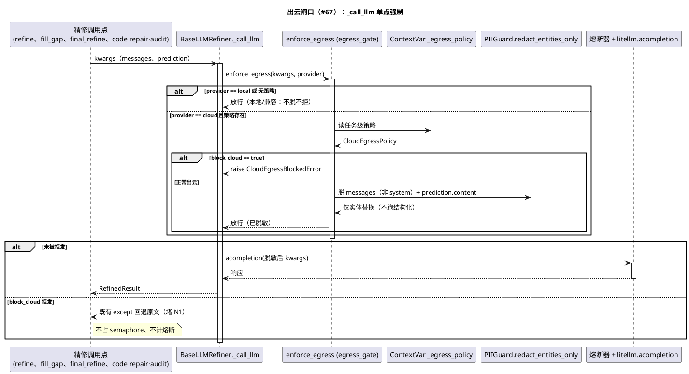

<!--
Copyright 2026 @lyty1997
Licensed under the Apache License, Version 2.0 (the "License").
-->

# 出云闸口下沉设计（#67：把「约定」变「结构强制」）

> 状态：**设计已确认，实现中**（2026-06-15）。机制采用**方案 A / ContextVar**（用户拍板，§3.4）。
> 分支：`feature/s-cloud-egress-gate`。
> 触发：2026-06-15 dev→main release 评审揪出两个 PII fail-closed 绕过实证（N1/N2），
> 证明 [pii-unification.md](pii-unification.md) §3.1「所有云端调用点只走闸口 `redact_for_cloud`」
> 是**约定**而非**结构强制**——任何漏审字段 / 新增调用点都能静默逃逸。
> 这是 PII 统一的 **S5**：把脱敏与 fail-closed 从「每个调用点自觉执行」下沉为「所有出云必经的单点强制」。

## 1. 问题：约定 ≠ 强制

[pii-unification.md](pii-unification.md) 把**脱敏动作**收进了 `PIIGuard.redact_for_cloud`，#36/#10 也把
fail-closed 逻辑接进了主路径。但「**是否 block_cloud**」与「**实体 lexicon 是否施加**」
仍由**每个云端调用点手动判断 / 手动接**——这是审计式（denylist），不是结构上不可绕过的单闸。
本轮评审抓到两个实证：

- **N1（fail-closed 被绕过）**：`pipeline/pipeline.py:2116` `_maybe_retry_final_refine_on_dup_h2`
  落在 `2100` 行 `if not block_cloud:` 守卫**之外**（仅受 `2115` 行 `if not truncated:` 控）。
  PII 实体检测失败 + `block_cloud_on_detect_failure=True`（用户明确要求 fail-closed）时，
  文档若存在重复 H2 标题，本路径仍把**整篇未脱敏 markdown** 发往云端。
  调用链：`2116 → _do_final_refine(3306) → _get_refiner(3182)` 在 `3209/_create_refiner(633)`
  **重新派生**出一个真实 refiner（绕过 `_stream_process` 设的 `refiner=None` 段级防线）
  `→ _final_refine(3334) → refiner.final_refine(llm/base.py:366) → _call_llm(238) → litellm.acompletion(285)`。
  根因：dup-H2 重试（`69c33a3`，2026-04-24）比 `#10` 守卫（`9ec71bf`，2026-06-04）早 6 周落地，**被漏包进守卫**。

- **N2（实体 lexicon 从未线程化到 code 诊断）**：`llm/code_repair.py` 的 `_redact_diag_dict` 对诊断自由文本
  （`summary` / `items[].message`，由 g++/clang **回显原始源码行**）只施加了结构化脱敏，
  **实体 lexicon（人名/机构名）从没接进**（该文件内 `lexicon` 出现 0 次）。诊断字段用的 `redact`
  是 `_make_regex_redactor`（`pipeline/pipeline.py:383`）产出的闭包 = `guard.redact_structured`（无 lexicon）。
  出错行附近注释里的 `// Author: 张三` 照样上云。根因：`_make_regex_redactor` 注释「不做实体替换，避免误伤
  import 路径/标识符」——这个理由**只对结构化正则成立**，被误用来连「精确实体串替换」一起跳过了
  （实体替换是精确 `str.replace`，「张三」→「[人名]」绝不会动 `import os`）。

**共同根因**：散点强制 = 每个调用点都对、漏一处就泄一处。N1 是漏了一个 `block_cloud` 守卫，
N2 是漏了一条 lexicon 支路。治本 = 把强制点收敛成**唯一一个、所有出云必经、调用点无法绕过**的闸口。

## 2. 目标与非目标

**目标**
- 出云的 fail-closed（block_cloud 拒发）与实体脱敏兜底，从「调用点自觉」下沉为「**单一 chokepoint 强制**」。
- 新增任何云端调用点，**无需记得做任何事**，也不可能把未脱敏 / fail-closed 该拦的内容发出去。
- N1：fail-closed 时 dup-H2 重试不发云端（闸口拒发 + 源头守卫双层）。
- N2：诊断 / file_path / 正文注释里的人名机构名送云前被实体脱敏（闸口统一施加 lexicon）。
- 覆盖 `messages` 之外的同源出云字段（`prediction.content`），跳过 `system` 指令文本。

**非目标**
- 不改结构化正则规则本身（`patterns.py` 不动），**不改结构化脱敏的分档策略**（doc/PPT=full、
  code body=tokens_only、code header / prompt 字段=full 全部维持 §9.5 决策）。
- 不改流式生产者/消费者并行模型。
- 不引入策略引擎 / 插件化脱敏管线（过度工程）。
- 不删除现有字段级脱敏（保留为纵深防御；闸口是兜底层，不是替代层）。

## 3. 核心设计：闸口下沉到 `BaseLLMRefiner._call_llm`

### 3.1 为什么是 `_call_llm`（唯一 chokepoint，已 grep 证实零旁路）

全后端 LLM 出云**唯一**网络出口是 `llm/base.py:285` `litellm.acompletion(**kwargs)`，
封装在 `BaseLLMRefiner._call_llm`（`base.py:238`）。grep 全 `backend/` **零命中**任何
直接 `litellm.completion` / `AsyncOpenAI` / `chat.completions` / `litellm.embedding` 旁路。
六条出云路径——doc 段级 `refine`、gap `fill_gap`、整篇 `final_refine`、code `refine`/`repair`/`audit`——
**全部汇入 `_call_llm`**（code 三个 refiner 内部都调 `self._base._call_llm`）。

`CloudLLMRefiner` 与 `LocalLLMRefiner` 都是 `BaseLLMRefiner` 的**空壳子类**（无方法覆盖），
共用同一个 `_call_llm`。因此闸口只需加固这一个方法，且**必须按 provider 区分**（本地不出云不脱）。

**复用既有 chokepoint，不新建发云函数**：现状 `_call_llm` 已是「熔断 + 限流 + 发包」的收口点，
只是对 `kwargs` 零检查零脱敏（收口点 ≠ 闸口）。把它从收口点**升级成闸口**最省改动、最难绕过——
新增任何出云调用都必经它。

### 3.2 闸口做两件事（都按 provider 短路本地）

`_call_llm` 入口（`provider == "cloud"` 且策略存在时）强制：

1. **block_cloud 拒发（堵 N1）**：`if policy.block_cloud: raise CloudEgressBlockedError(...)`，
   在 `breaker.before_call()` **之前**抛——不占 semaphore、不计费、不触发熔断 `on_failure`。
   六条路径的调用方现状**均有** `try/except → 回退原文/reassembled`（`_refine_segment_with_cache`、
   `fill_gap`、`_final_refine` 的 `gather(return_exceptions=True)`、code 三 refiner 各自的 except），
   异常天然被接住 = 「这一步退原文」，与现有 fail-closed 行为一致。

2. **仅实体 lexicon 兜底脱敏（堵 N2）**：对 `kwargs["messages"]` 中 `role != "system"` 的 `content`
   与 `kwargs["prediction"]["content"]`（若存在），施加**仅实体替换**
   `guard.redact_entities_only(content, policy.lexicon)`（人名/机构精确串替换）。**不跑结构化正则**。

`provider == "local"`：整段闸口**短路**（既不查 block_cloud 也不脱敏——本地数据不出本机，无需脱）。
策略缺失（`None`，如单元测试直接构造 refiner）：闸口**不介入**，保持旧行为（向后兼容）。

### 3.3 为什么「仅实体 lexicon」是安全的兜底（零 #36 回归，化解 critique high #3）

闸口是 doc/code/PPT **共享**出口，`kwargs` 里没有可靠信号区分「这是 code 路径」。
草案曾设想在闸口按 profile 跑结构化（full/tokens_only），但这无法在共享出口稳定区分，
对 code 的 `to_prompt_json`（内含 tokens_only 正文）跑 full 结构化会改坏 `password = get_secret()`，
破坏 #36 的回归。**解法：闸口绝不跑结构化，只做实体替换。**

实体替换（`redactor.py:201 _apply_lexicon`）只对 lexicon 里的**精确人名/机构串** `str.replace`：
- 不碰标识符 / import 路径 / namespace（它们不在 lexicon 里）→ 不破 code body 的 tokens_only 取舍。
- 对 doc/PPT/code header：上游已 `redact_for_cloud(full+lexicon)` 替过 → 闸口幂等 no-op。
- 对 code 诊断/file_path/body 注释：上游**没**施 lexicon（N2）→ 闸口补上 = N2 修复。

即「实体 lexicon 是唯一一种施加到任何出云文本都安全的脱敏」。结构化脱敏的 profile 复杂度
继续留在**字段级上游**（已正确分档），闸口不碰。于是 critique high #3（profile 无法在闸口分档）
直接消失——闸口根本不做需要分档的那件事。

### 3.4【待确认决策】策略如何到达闸口：ContextVar（推荐）vs 每次调用参数

闸口要读到三样**任务级**值：`block_cloud: bool`、`lexicon: EntityLexicon | None`、
`guard: PIIGuard`（构造 / 已构造）。三者都是**一个任务一份**（非每次调用不同），
关键约束是 `process_tree` 并发子目录（`asyncio.gather` 多 leaf）**不能串味**
（A 子目录 `block_cloud=True` 被 B 子目录覆盖）。两个方案：

**方案 A：ContextVar（推荐）**
- 模块级 `_egress_policy: ContextVar[CloudEgressPolicy | None]`，`_call_llm` 用 `.get()` 读。
- 每个模式在**自己的 per-document 协程作用域内** `set()` 策略（`with` 上下文管理器，`finally` `reset`），
  并在 `block_cloud`/`lexicon` 就绪时更新（per-task 持有对象，mutation 任务隔离）。
- **为什么推荐**：①`_call_llm` 紧邻处已在用 contextvar——`current_profiler()`（`base.py:248`）取
  同类「任务级环境态」，闸口读策略与之完全一致，是该模块的**既有惯例**；②contextvar **天生 task-local**
  （`asyncio.gather` 对每个 coroutine 复制 context），只要在 leaf 协程内 `set` 就**不串味**——
  正是 critique high #2「共享实例串味」的标准解法（contextvar 不是共享可变状态，是任务本地态）；
  ③**零签名改动**：不动 `LLMRefiner` Protocol、不动六个调用点签名、不动 `code_repair.py`/`code_refine.py`
  （它们调 `self._base._call_llm`，闸口在共享 base 一处生效，code 路径自动覆盖）、不动现有单测调用方。
- **代价/纪律**：策略「隐式」，必须**在 leaf 任务内** `set`（若在 `gather` 之前的父作用域 set 会被子任务共享）。
  靠并发隔离测试 + 全局「block_cloud ⇒ 0 次出云」测试兜底（§8）。

**方案 B：每次调用显式参数（critique 推荐）**
- `_call_llm(kwargs, *, egress: CloudEgressPolicy | None = None)`，并给 `refine`/`fill_gap`/`final_refine`
  （含 Protocol）+ code 三 refiner 的公开方法各加 `egress` 形参，六个调用点显式传当前任务值。
- **优点**：策略「显式可审计」，调用点读签名即见；无 contextvar 作用域纪律。
- **代价**：改动面大（Protocol + 8 签名 + 6 调用点 + code 两文件 + 现有单测调用方都要补 `egress`）；
  `egress=None` 默认仍可被遗忘（与 N 类 bug 同形），靠同一组测试兜底。

> **已确认采用方案 A（ContextVar）**（用户拍板 2026-06-15）。理由：与 `_call_llm` 处既有
> `current_profiler()` 惯例一致、task-local 正解串味、改动最小（不动 Protocol / code 两文件 / 现有测试）；
> 安全性由「§8 全局 block_cloud ⇒ 0 出云」这条整体测试结构化兜底，而非靠每个调用点记得传参。

### 3.5 覆盖盲点（critique 全部吸收）

| 盲点 | 现状风险 | 闸口处理 |
|---|---|---|
| `prediction.content`（`base.py:223-226`） | `enable_prediction=True` 时把 `raw_markdown`/`markdown` 原文作为第二载荷出云，messages 级脱敏覆盖不到 | 闸口对 `kwargs["prediction"]["content"]` 一并施实体脱敏；block_cloud 拒发本就拦整次调用 |
| `system` message（`prompts.py` 各 `build_*`） | 对 system 指令文本做脱敏会污染示例占位 / 指令短语，降精修质量 | 闸口**跳过** `role == "system"` 的 content |
| 本地 LLM 误脱 / 误拒 | Cloud/Local 共用 `_call_llm` | 闸口最前 `if provider == "local": 放行`（不脱不拒） |
| `unresolved_items.context/note`（`code_repair.py:521-523` `asdict` 直出） | audit 上下文自由文本裸发 | 闸口 messages 级实体兜底覆盖（自由文本里的人名被替）；字段级加固见 §5 可选项 |

## 4. N1 修复：闸口 + 源头双层（纵深防御）

1. **闸口层（治本）**：`_maybe_retry_final_refine_on_dup_h2 → _do_final_refine → _final_refine →
   refiner.final_refine → _call_llm`，无论绕过多少上层守卫，**最终必经 `_call_llm`**。
   fail-closed 时策略 `block_cloud=True` → 闸口在 `breaker.before_call` 之前抛 `CloudEgressBlockedError`，
   整篇 markdown **一字不出云**；`_final_refine` 的 `gather(return_exceptions=True)`（`base.py` / `3334`）
   接住异常 → 回退原 doc。**前提**：`3209/_create_refiner` 派生的 refiner 必须能读到 `block_cloud=True`——
   方案 A 由 contextvar 携带（refiner 实例无状态，绕不过）；方案 B 由 `egress` 参数沿
   `_do_final_refine → _final_refine → final_refine` 穿透。

2. **源头层（双保险）**：把 `pipeline/pipeline.py:2115` 的 `if not truncated:` 改为
   `if not truncated and not block_cloud:`（等价于把 dup-H2 重试挪进 `2100` 的 `if not block_cloud:` 块内）。
   fail-closed 时重试根本不发起，连闸口都不必触发。即便将来再加新的 `final_refine` 旁路，闸口仍兜底。

两层缺一仍安全：只有闸口 → 重试仍发起但被拒发退原文；只有源头 → 闸口冗余但无害。

## 5. N2 修复：闸口统一实体兜底（主修）+ 字段级加固（可选）

- **主修（闸口）**：闸口对所有出云 `messages`（非 system）+ `prediction.content` 统一施 `redact_entities_only`。
  code 诊断 `summary`/`items[].message`、`file_path`、正文注释里的人名机构名因此被替换——**无需改
  `code_repair.py`/`code_refine.py`**（方案 A 下 code 路径经 `self._base._call_llm` 自动覆盖）。
  `lexicon` 出现次数从 0 变正数（在闸口侧）。

- **字段级加固（纵深防御，已落地 2026-06-16）**：在「送进闸口前」就脱（更早、双保险），让 code 模式的
  `prompt_redact` 也带 lexicon：①`_redact_code_pii` 把检测到的 `lexicon`（原仅喂 header）一并返回（已改为
  返回 `(block_cloud, lexicon)`）；②`_make_regex_redactor(pii_cfg, lexicon)` 非空时内部走
  `guard.redact_for_cloud(text, lexicon)`（结构化 + 实体）替代 `redact_structured`；③`code_repair.py` 的
  `build_consistency_audit_context` 经新 helper `_redact_unresolved_item` 把 `unresolved_items.context/note`
  也过 `redact`——**这一项尤其重要**：unresolved 自由文本是闸口够不到结构化 PII 的唯一缝（闸口只兜底实体），
  字段级在此补结构化（手机/邮箱）。结构化分档不变（prompt 字段仍 `full`，§9.5）。

## 6. 迁移清单（方案 A / ContextVar 口径）

| 文件:行 | 符号 | 改动 | 修 |
|---|---|---|---|
| `llm/egress_gate.py`（新建） | `CloudEgressPolicy` / `_egress_policy` ContextVar / `egress_scope()` ctxmgr / `CloudEgressBlockedError` | frozen dataclass(`block_cloud`,`lexicon`,`guard`) + 模块级 ContextVar + `with` 设/复位 + 业务异常（接入 `AppError`/`ApiBusinessError`） | 基建 |
| `privacy/guard.py` | `PIIGuard.redact_entities_only(text, lexicon)` | 新增公开方法，委托 `self._redactor._apply_lexicon`（仅实体、不跑结构化）；`enabled`/`lexicon=None` 时原样返回 | 基建 |
| `llm/base.py:238` | `BaseLLMRefiner._call_llm` | 入口加闸口：`provider!="local"` 且策略存在 → `block_cloud` 抛 `CloudEgressBlockedError`（before breaker）；对 `messages`(非 system)+`prediction.content` 施 `redact_entities_only`。local / 策略 None 全短路 | N1+N2 治本 |
| `pipeline/pipeline.py:1853-1973` | `_stream_process`（doc/PPT） | 在 per-document 协程内 `egress_scope(policy)`；`block_cloud`/`entity_lexicon` 就绪时更新策略（`1875/1900-1906` 处） | N1 |
| `pipeline/pipeline.py:1488-1521` | `_code_pipeline` code 段 | 在 code 任务作用域 `egress_scope(policy)`（`_redact_code_pii` 返回 `block_cloud`/lexicon 之后） | N2 |
| `pipeline/pipeline.py:2115` | `_finalize_single_doc` dup-H2 守卫 | `if not truncated:` → `if not truncated and not block_cloud:`（源头层双保险） | N1 |
| `pipeline/pipeline.py:2375 / 3104 / 3422` | `refine` / `fill_gap` / `final_refine` 调用点 | 方案 A 下**不改**（闸口经 contextvar 生效）；仅验证不被破坏（已手动脱敏处幂等叠加） | 验证 |
| `llm/code_repair.py` / `code_refine.py` | 三 code refiner | 方案 A 下**不改**（调 `self._base._call_llm`，闸口自动覆盖） | 验证 |

> 方案 B 口径下，最后两行从「不改/验证」变为「加 `egress` 形参并透传」，且 Protocol + 6 调用点 + 现有单测同步——故 §3.4 推荐 A。

## 7. 风险与缓解（逐条吸收 critique）

| 风险 | 缓解 |
|---|---|
| **本地 LLM 误脱/误拒**（Cloud/Local 共用 `_call_llm`） | 闸口最前 `if provider=="local": 放行`；测试断言 local 路径 messages 不被改写、不被拒发 |
| **并发子目录串味**（`process_tree` 多 leaf 共享 `self._refiner`） | 方案 A：contextvar task-local，**必须在 leaf 协程内 set**；并发隔离测试（一 leaf `block_cloud=True`、一 `False`，断言互不影响）。方案 B：值随调用传，天然隔离 |
| **code tokens_only 被误伤**（#36 的 35 项回归） | 闸口**只做实体替换、绝不跑结构化**（§3.3）；跑 #36 回归套件断言 `password=expr` 类正文不被改坏 |
| **system prompt 被污染** | 闸口跳过 `role=="system"` |
| **`prediction.content` 漏脱** | 闸口对 `prediction.content` 一并脱；`enable_prediction` 默认 False，但显式处理不留隐式 fail-open |
| **`CloudEgressBlockedError` 未被接住 → 整任务崩** | 已核实六路径均有 except 回退；重点验证 N1 链 `_maybe_retry → _do_final_refine → _final_refine` 的 `gather(return_exceptions=True)` 走「异常→回退原文」而非「静默成功空结果」 |
| **熔断误触发 / 占 semaphore** | 拒发在 `breaker.before_call` 之前，不计 `on_failure`、不占 semaphore；测试断言熔断计数不变 |
| **性能：大文档重复扫描** | 闸口只做实体替换（有界精确串替换），**不**重跑全量结构化正则；对已替过的 doc/PPT 幂等 no-op，成本远低于草案的「messages 级 full 重扫」 |
| **lexicon 时序**（早窗口闸口生效但 lexicon 未就绪） | 保留现有 `_entity_redaction_pending` 早窗口推迟 + `refiner=None`，不因有闸口拆推迟；策略对象的 lexicon 随就绪更新 |
| **`ner_backend=none` 知情放弃** | `_should_block_cloud` 语义不变（`block_cloud=False`），闸口不拒发 |

## 8. 测试计划

- **N1 整体（结构兜底，最关键）**：构造「未截断 + 含重复 H2 + `block_cloud=True`（模拟 NER 失败）」doc 任务，
  **mock `litellm.acompletion` 断言全程 0 次调用**（覆盖 dup-H2 重试路径），输出退回本地组装文档。
  这条「block_cloud ⇒ 0 出云」是抓任何未来 N1 类绕过的整体安全网。
- **N1 闸口单测**：给带 `block_cloud=True` 策略 + `provider=cloud` 调 `final_refine` → 断言抛
  `CloudEgressBlockedError` 且未调 litellm；`provider=local` 同策略断言正常放行。
- **N2 实体兜底**：code 任务诊断 `summary` 含 g++/clang 回显且回显行带 `// Author: 张三`、lexicon 含「张三」→
  断言送达 `_call_llm` 的 messages 里「张三」被替成占位符；`file_path` `/Users/张三/` 同样被替。
- **本地 LLM 不脱**：`provider=local` 任务，断言 messages 原文（含人名）原样送达、不被拒发。
- **code §9.5 / 35 项回归**：跑 #36 既有 code 回归套件，断言全绿、`password = get_secret()` 类正文不被改坏。
- **prediction / system**：`enable_prediction=True` 断言 `prediction.content` 被实体脱敏；断言 `system` content 不被改写。
- **并发隔离**：`process_tree` 两 leaf（一 `block_cloud=True`、一 `False`）→ 断言前者 0 出云、后者正常，互不串味。
- **幂等**：对已实体脱敏的 messages 再过闸口，输出不变。
- **doc/PPT/gap 现路径不回归**：段级 `2350`、gap `3093-3101`、PPT `1248` 叠加闸口后输出快照不变。
- 断言一律从输入派生（不写死数据集标识符，遵循项目测试规则）。

## 9. 工程量评估

**判定：刚刚好（偏精简）。**
- 复用既有唯一 chokepoint `_call_llm` 而非新建发云函数 / 新拦截层；方案 A 下改动集中在
  `base.py._call_llm` + 一个新 `egress_gate.py` + `guard` 一个新方法 + 三处 `egress_scope` 设置 + 一行源头守卫——
  **不动 Protocol、不动 code 两文件、不动现有测试调用方**（不过度）。
- 把 block_cloud 与 lexicon 从「每个调用点手动」下沉为「必经强制」，**根治** N1/N2 两类系统性缺陷
  而非各打补丁（不欠）。
- 保留纵深防御（N1 闸口+源头、字段级加固可选）符合 fail-closed 安全场景应有的冗余，
  但没到引入策略引擎/插件化管线的过度。
- 闸口只做「唯一安全可统一施加」的实体替换，结构化分档留在字段级——不为假想扩展性提前抽象。

## 10. 相关文档

- [pii-unification.md](pii-unification.md) — PII 统一总设计（本设计是其 S5：把 §3.1「只走闸口」的约定变结构强制）
- [pii-local-ner.md](pii-local-ner.md) — 本地 NER（lexicon 来源）
- [privacy.md](privacy.md) — 现状 PII 脱敏层
- [pipeline.md](pipeline.md) — Pipeline 数据流与出云调用点
- GitHub issue **#67**（治本 umbrella，含 N1/N2 验收）；关联 #10 / #36 / #61 / #62
