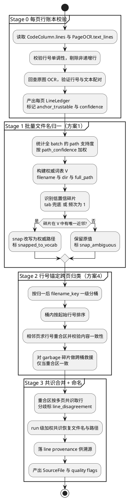
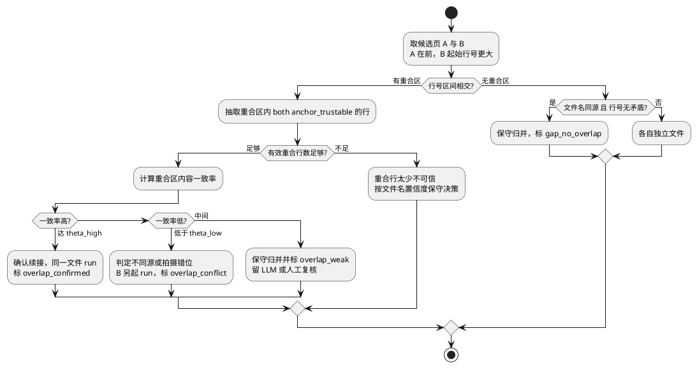

<!--
Copyright 2026 @lyty1997

Licensed under the Apache License, Version 2.0 (the "License");
you may not use this file except in compliance with the License.
You may obtain a copy of the License at

    http://www.apache.org/licenses/LICENSE-2.0

Unless required by applicable law or agreed to in writing, software
distributed under the License is distributed on an "AS IS" BASIS,
WITHOUT WARRANTIES OR CONDITIONS OF ANY KIND, either express or implied.
See the License for the specific language governing permissions and
limitations under the License.
-->

# 处理层（processing/）

## 1. 职责

对 OCR 输出进行后处理。普通文档模式包含页内文本清洗、相邻页去重合并和长文档分段；代码模式额外包含 IDE 布局识别、代码栏组装、跨页源文件分组、参考源码检索和轻量诊断。各模块保持纯处理逻辑，由 Pipeline 按任务配置编排。

## 2. 文件清单

| 文件 | 职责 |
|---|---|
| `processing/cleaner.py` | OCR 输出清洗（页内去重、乱码移除、空行规范化） |
| `processing/dedup.py` | 相邻页重叠检测与合并：`IncrementalMerger`（流式逐页增量）+ `PageDeduplicator`（批量参考实现） |
| `processing/segmenter.py` | 文档分段：`StreamSegmentExtractor`（流式增量切段，生产路径）+ `DocumentSegmenter`（批量全切，参考实现） |
| `processing/ide_layout.py` | IDE 截图布局识别，产出代码区、侧栏和元信息候选 |
| `processing/code_assembly.py` | 基于行号锚点把 OCR text_lines 组装为代码栏 |
| `processing/code_column_ocr.py` | 对识别出的代码 column 裁剪增强后二次 OCR（`secondary_column_ocr`，默认关） |
| `processing/code_file_grouping.py` | 将跨张 PageColumn 按路径/文件名聚合为 SourceFile |
| `processing/code_context.py` | 从只读参考源码根目录检索相关片段，辅助 scoped repair |
| `processing/code_diagnostics.py` | 多语言轻量诊断，输出 syntax / semantic / dependency 标注 |
| `processing/ide_meta_extract.py` | 从 IDE 顶栏、tab、breadcrumb 提取路径、文件名和语言候选 |
| `processing/ocr_postfix.py` | OCR 字符级后处理与常见混淆修正 |

> `preprocessor.py` / `ngram_filter.py` 位于 `ocr/` 下（worker 内部使用），见 [ocr.md](ocr.md)。

## 3. 对外接口

### 3.1 OCRCleaner（processing/cleaner.py）

```python
class OCRCleaner:
    """OCR 输出清洗器"""

    async def clean(self, page: PageOCR) -> PageOCR:
        """
        读取 page.output_dir/result.mmd，清洗后填充 cleaned_text。
        步骤：remove_repetitions → remove_garbage → normalize_whitespace
        返回同一个 PageOCR 对象（cleaned_text 已填充）
        """
```

**调用约定**：
- 输入：OCR 层产出的 `PageOCR`（`raw_text` 已填充，`cleaned_text` 为空）
- 输出：同一个 `PageOCR`，`cleaned_text` 被填充
- 异步接口：内部文件 IO 使用 `aiofiles` 读取 `result.mmd`
- 基于 `result.mmd`（grounding 已在 OCR 引擎内部处理完毕）

### 3.2 IncrementalMerger / PageDeduplicator（processing/dedup.py）

流式生产路径用 **`IncrementalMerger`**：消费者每收到一页就 `add_page(page)` 增量滚动合并，
内部复用 `merge_two_pages` 的 suffix-prefix 锚定去重，append-only 不回改已合并文本。
`PageDeduplicator.merge_all_pages()` 是等价的**批量参考实现**，保留作 `IncrementalMerger`
的一致性测试基准（`tests/processing/test_incremental_merger.py` 断言两者输出逐字符相等）。

```python
class IncrementalMerger:
    """流式逐页增量合并去重。"""

    def __init__(self, config: DedupConfig) -> None: ...
    def add_page(self, page: PageOCR) -> None: ...   # 逐页喂入
    def get_markdown(self) -> str: ...               # 当前已合并文本
    def get_all_images(self) -> list[Region]: ...
    @property
    def page_count(self) -> int: ...


class PageDeduplicator:
    """批量相邻页重叠检测与合并（参考实现 / 测试基准）"""

    def __init__(self, config: DedupConfig) -> None: ...

    def merge_two_pages(self, text_a: str, text_b: str) -> MergeResult:
        """
        合并两页文本，返回合并结果。
        检测重叠区域并只保留一份。
        """

    def merge_all_pages(
        self,
        pages: list[PageOCR],
        on_progress: Callable[[int, int], None] | None = None,
    ) -> MergedDocument:
        """
        滚动合并所有页面：
        merged = page[0] → 逐页 merge_two_pages(merged, page[i])
        同时收集所有页的 regions 汇总到 MergedDocument.images

        页边界标记：
        - 每页文本头部插入 <!-- page: page1.jpg --> 标记
        - 供 LLM 精修时定位 gap 所在的照片

        图片引用重写：
        - OCR 产出的引用格式为 （相对于 {stem}_OCR/ 目录）
        - 合并时重写为 （相对于 output_dir）
        - 确保 Renderer 能根据路径找到源文件
        """
```

**调用约定**：
- 构造函数接收 `DedupConfig`（与 OCR 引擎接收 `OCRConfig` 风格一致）
- `merge_two_pages()` 输入两段纯文本（`cleaned_text`），返回 `MergeResult`
- `merge_all_pages()` 输入 `PageOCR` 列表（需已填充 `cleaned_text`），返回 `MergedDocument`
- `merge_all_pages()` 负责收集各页 `PageOCR.regions` 汇总到 `MergedDocument.images`
- 每页文本头部插入 `<!-- page: {image_filename} -->` 标记，供 LLM 定位 gap
- 图片引用从 `` 重写为 ``
- 重叠区域检测后只保留一份，不插入额外标记

### 3.3 文档分段（processing/segmenter.py）

流式生产路径用 **`StreamSegmentExtractor`**：从增长中的 markdown 一次切出一段（`try_extract`），
段长 `max_chars` 每次调用传入（由 `RateController` 运行时自适应 L*），只做 backward overlap
（流式下未来文本未知）。`DocumentSegmenter` 是非流式的全切变体（一次切完全文），保留作参考实现。

两者共同的切分逻辑：标题优先切分（`#`/`##`/`###`） → 过长则空行二次切分 → 合并过小片段。
overlap 作为上下文拼进段文本（引入“可见重复”，由 LLM 精修时删除）；Pipeline 在 `_reassemble()`
阶段仅对各段 `markdown` 做 `"\n".join(...)` 重组，不依赖任何特殊标记。

```python
class StreamSegmentExtractor:
    def __init__(self, overlap_lines: int = 5) -> None: ...

    def try_extract(
        self, full_text: str, offset: int, max_chars: int,
    ) -> tuple[str, int] | None:
        """文本够长则切出一段，返回 (段文本, 新 offset)；不够长返回 None。"""
        ...

    def extract_remaining(
        self, full_text: str, offset: int,
    ) -> tuple[str, int]:
        """哨兵后处理尾段（剩余全部文本）。"""
        ...
```

**调用约定**：
- 输入：当前已合并的完整 markdown + 上次切到的 `offset` + 本次段长上限
- 输出：`(seg_text, new_offset)` 或 `None`（文本不足，等更多页面）
- 上下文（`overlap_before`/`overlap_after`）在 `RefineContext` 中由 Pipeline 单独构造

### 3.4 代码模式处理链路

启用 `PipelineConfig.code.enable` 后，Pipeline 不再把 OCR 文本直接送入普通 Markdown 分段，而是消费 `PageOCR.text_lines` 进入 IDE 专用链路：

1. `ide_layout.py` 识别 IDE 截图中的代码区域、侧栏/面包屑等元信息区域。
2. `code_assembly.py` 依赖行级 bbox 和行号锚点组装每张图的代码栏，保留来源页、列索引、bbox、行号范围和质量 flags。
3. `ide_meta_extract.py` 提取 `filename/path/language/path_candidates/path_confidence`。
4. `code_file_grouping.py` 将 `PageColumn` 聚合为 `SourceFile`，按路径/文件名跨页合并，行号重叠只保留首份；无法确认的 gap 以 flags 暴露给质量报告。**该步当前实现的碎片化缺陷与重构设计见 §3.6。**
5. `llm/code_refine.py` 与 `llm/code_repair.py` 对 `SourceFile.merged_text` 做字符级精修和诊断驱动 scoped repair。
6. `code_diagnostics.py` 在写出前或编辑态实时运行轻量诊断。标准库解析优先，外部工具缺失时降级为 `tool_unavailable`，不让任务失败。

`CodeDiagnosticRunner` 当前支持 Python/JSON/TOML/XML/YAML 标准库解析，以及 JavaScript/TypeScript/C/C++/Go/Rust 的外部工具检查。诊断器会在临时副本中屏蔽已定位语法错误、为缺失 include 生成 stub header 并复跑，以暴露后续独立错误；同时扫描代码区 CJK / 全角字符 OCR 噪声。

### 3.5 代码模式设计决策由来（v1 → v2 → v3）

> 本节凝练 IDE 代码模式布局识别的关键设计反转与多数据集验证结论，供后续维护理解"为什么用行号锚点"。详细逐数据集统计已随历史设计文档下线，可从 git 历史检索。

**v1（已废弃）——像素方差几何切分**：基于"几何检测剥 IDE UI + 按固定比例多栏切割"。根本错误是假定 sidebar/tab/terminal 占图固定比例——真实 IDE 任意可拖拽（分栏可拖、sidebar 折叠、字体缩放、分辨率不一），所有固定阈值都失效。8 张 spike 实测 7/8 走 sidebar fallback、1/8 column 硬切，不可用。同期调研的 PaddleOCR-VL `merge_layout_blocks=False`、PP-DocBlockLayout 降阈值、PP-StructureV3 reading-order 均不可用（后者方向相反，会把多栏代码错误合并为单列）。

**v2（当前方向）——行号列锚点**：改用 IDE 编辑器的内在不变量"行号列"做布局锚点（`text=^\d{1,4}$` + score≥0.8 → x1 聚类 → 单调性筛选 → `LineNumberAnchor`），与字体/缩放/拖拽/sidebar 折叠完全无关，由数据驱动且自带 OCR 容错。

**v3 修正（关键教训）**：v2 初版加了"unpaired_codes 推断插入"，看似救回 6396 行代码；用户质疑"救的是不是垃圾"后抽样审计发现约 50% 是 OCR 切碎残片 + breadcrumb/git blame/status bar 等 UI 噪声，"6396 行"是误导性指标。v3 据此：①回滚强插入，unpaired 只标 quality flag 交由 LLM 精修阶段按需补全；②`ide_layout` 区域归类从 bbox 边界改为 **bbox 中心点**判 above/below_code，从源头让 UI 噪声不进 column（治本）；③`anchor.num_range` 上限 3000 过滤极端噪声 anchor（堆栈 PID 等），真长文件仍通过。

**多数据集鲁棒性结论（1259 张 / 6 数据集，v3 最终）**：

| 场景 | 检出/成功率 | 说明 |
|---|---|---|
| IDE 代码场景（1137 张，4 数据集） | **99.82%**（1135/1137） | 漏检 2 张为无行号列结构的 binary/图片 diff |
| 栏数自适应 | 1 / 2 / 3+ 栏全覆盖 | 首次在 ide_diff 见到 single 与 3 栏（git diff 旧/新行号 + 右侧文件） |
| 文档误判（false positive） | **0%** | 73 张非代码图（普通文档 + 飞书文档）零误识为代码 |

核心经验：①"指标看着好"≠ 实际质量好，多数据集 audit 不可缺；②从上游边界判定修才稳，强插入是治标；③保守的代码（不强插 unpaired）给 LLM 精修留干净基础，优于基于污染数据补救。

### 3.6 代码模式跨页归类重构（方案 1+4，行号锚定）

> **状态：设计待实现。** 核心原则：**行号 + 行内容 是比文件名更硬的真相源。**

**问题**：chromium 数据集 157 张 IDE 截图，本应收敛成 **8 个真实源文件**，实际产出 **16 个**，半数是从真实文件掉下来的「幽灵碎片」（每个 1–7 页）：`ui/g/gl_surface_egl.cc`（面包屑 `gl` 漏 `l`）、`ui/gl/giesz.cc`（窗口标题被 OCR 成 `giesz.cc`）、`ui/gl/c/gl_surface_egl.h`（文件图标 "C" 当成目录 `c/`）、`…_x11xv__gles2.h`（双下划线）、`media/…/gpu_mojo/media/client/linux.cc`（文件名碎块当多级目录）等。

**根因（三层防线全被 OCR 噪声击穿）**：①面包屑（`ide_meta_extract` 设计中的「唯一真相」）本身被污染——丢点 `gles2.h`→`gles2h`（`FILENAME_RE` 匹配失败 → 退标签兜底）、漏字符、图标段误认、文件名碎块被当多级目录；②标签兜底抓错——OCR 看不到高亮/置灰，`×` active 正则脆（`.h 9+×` 不匹配）退化成「取最上面标签」抓到灰色 preview 标签，窗口标题噪声过滤也脆（`-src[`→`-sic[` 漏拦）；③`_merge_near_duplicate_filenames` 开口太窄——按精确 compact-dir 分桶（目录有噪声就进不同桶永不比较）+ 10% 页数比例硬闸把 18% 的双下划线变体判成「真实独立文件」。

**为什么 IDE 比文档稳健**：文档去重靠 `SequenceMatcher` 在整段文本里模糊找重合位置（§5.2），易受 OCR 噪声干扰。IDE 自带**行号这把绝对标尺**——重合区由行号精确界定（不用猜匹配位置），内容校验退化为「同一行号文本是否相等」的点对点判断：锚点确定、判定局部化、可量化。

**总体流程**（四 Stage 插在「逐页组装 → `group_into_files`」之间并重构其内部）：



**Stage 0 — 每页行账本完整性校验（保证源干净）**：把每个 `PageColumn` 的逐行明细加工成可信的 `LineLedger`，让污染/错配行不污染后续跨页比对。输入 `CodeColumn.lines`（`CodeLine.line_no/text/indent/bbox/is_inferred_line_no`）+ 该页 `PageOCR.text_lines`。三项确定性校验（零 LLM）：①**单调性 enforce**，非递增行标 `code.line.nonmonotonic` 并降为非锚点；②`is_inferred_line_no=True`（行号是推断的）→ `anchor_trustable=False`；③**回查原图 OCR**：用 `CodeLine.bbox` 溯源到 `text_lines` 对应 y 带，验证 `CodeLine.text` 是该位置文本的忠实拷贝，不一致标 `code.line.pairing_suspect`。产出 `LineLedger = {line_no -> LineEntry(text, indent, anchor_trustable, confidence)}`。这一步对应「先逐行比对文本和原图 OCR，行号对得上，保证源干净」。

**Stage 1 — 批量文件名/路径归一（方案 1）**：基于「正确名字在 157 页里压倒性高频，OCR 错读零星且低置信」。①按 `path_confidence` 加权统计全 batch 的 `(path/dir/filename)` 支持度，门槛（支持度 ≥ τ 或频次 ≥ k）以上进权威词表 V；②识别候选碎片（低置信 / 频次 1 / 带噪声 flag）；③在 V 中找唯一最近邻 snap 改写（filename 距离做扩展 normalize——去图标残段、合并重复下划线、容忍缺失扩展名点、视觉混淆归一；dir 距离容忍单字符目录段增删、漏字符、`_`↔`/` 互换），命中标 `code.meta.snapped_to_vocab` 保留原值，多邻/不够近则标 `code.meta.snap_ambiguous` 交 Stage 2 裁决。**完全 garbage 的名字（V 无近邻，如 `giesz.cc`）故意不改，留给 Stage 2 用行号独立判定。**

**Stage 2 — 行号锚定的跨页归类（方案 4 主体）**：①**候选分桶**：按归一后 `(filename_key, ext)` 一级聚类缩小比较空间（行号在不同文件间会重复，不能只靠行号全局聚类，必须先用文件名 prior 圈候选）；②**行号重合链装配**（核心，下图）：桶内按起始行号排序，相邻页求行号区间交集，对重合区内双方 `anchor_trustable` 的行比内容一致率——三分支裁决；③**跨桶救援**（修 garbage 碎片关键）：对 `snap_ambiguous`/garbage 碎片绕开文件名，与「行号相邻 + 重合区内容高度一致」的已确认 run 直接匹配，**强制要求重合区存在且一致率 ≥ θ_high**，没有重合区的 garbage 碎片不救（标 `orphan_unrescued`，宁可漏救不可错并）；④保留 `_enforce_one_page_one_file`（同图同名硬约束）。



**Stage 3 — 内容感知合并 + 命名 + 溯源**：现有 `_merge_columns_by_line_no` 对同行号「保留首份、无校验」，会无声丢弃后到页版本。重构为：①**共识合并**——同一行号多页都有 `anchor_trustable` 文本时取多数共识，分歧标 `code.merge.line_disagreement` 记录候选、正文取 `confidence` 最高者；②**gap** 沿用小填空行 / 大注释占位 + flag；③**line provenance（必做，用于可溯源调试）**——把「每行最终取自哪页、是否有分歧、落选候选」持久化到 `SourceFile.line_provenance`，供 LLM 精修与前端溯源（不持久化则碎片合并出错时无从调试）。

**文件名/路径的确定——run 级加权共识恢复**：

确定文件名/路径的**顺序**很关键——先用行号+内容把页确认成一个 **run**（S0–S2），**再**对这批页的全部 OCR 名字观测做共识恢复。名字是「已确认 run」的派生属性，靠 run 内冗余去噪，**不跨 run 投票**（否则不同文件名字互相污染）。实践中大多数命名错根上是**归类错**（碎片没并进 run，票池被割裂），S0–S2 修对后光靠频次投票就已基本正确；下面的两级共识是短 run / 无单条完全正确观测时的鲁棒性兜底。

票源（每页可多条，按可信度加权）：面包屑 path+filename（权重最高）、**窗口标题栏 filename**（`<name>-src[SSH:…]` 是 active 文件、字大对比高，**新纳入**——现在只拿来当噪声过滤太浪费）、标签 filename（兜底，低权重）。

两级共识（替代现有 `_build_source_file` 对**整串**投票——无单条完全正确时即失效）：

1. **路径分段投票**（segment-level，从右对齐）：把每条 path 切成 `/` 段，按「距文件名的相对位置」对齐（filename=第 0 位、上级目录=第 1 位…，从右更稳），逐位按加权频次投票。解决 `ui/g`↔`ui/gl`（`gl` 段 80 票 vs `g` 1 票）、虚假 `c/` 段被无该段的多数票淘汰、`gpu_mojo/media/client` 误拆（正确合并段高频胜）。
2. **段内字符级共识**（character-level）：同位段的多个噪声变体对齐后逐位取多数，能从多条都不完美的观测里拼出 canonical 串。解决丢点 `gles2h`、双下划线、typo `egll`、扩展名漏字符 `.c`↔`.cc`。实现取向：按相似度聚类该段观测取最大簇，簇内长度归一后逐位多数（细节留实现期）。
3. **置信度回填**：canonical path 的 `path_confidence` = 多数票占比（越集中越高）；分歧大标 `code.name.consensus_low` 留人工。

**数据结构改动**：新增 `LineEntry`（`line_no/text/indent/anchor_trustable/confidence`）、`LineLedger`（每 PageColumn 一份 `{line_no -> LineEntry}`）、`PathVocabulary`（词表）；`SourceFile` 新增 `line_provenance`（每行来源页 + 分歧候选）；`IDEMeta` 零侵入复用现有 `path_candidates/path_confidence/flags`，snap 后改写并保留原值。`CodeLine` 不改（已含 `bbox/is_inferred_line_no`）。

**新增 quality flags**：`code.line.{nonmonotonic,pairing_suspect}`、`code.meta.{snapped_to_vocab,snap_ambiguous}`、`code.group.{overlap_confirmed,overlap_conflict,overlap_weak,gap_no_overlap,cross_bucket_rescued,orphan_unrescued}`、`code.merge.line_disagreement`、`code.name.consensus_low`。沿用 v3 教训：保守标 flag、不强改正文。

**阈值**（经验初值，全部挂 `CodeRestoreConfig` 可配，落地后多数据集调参）：`overlap_confirm_ratio`(θ_high)=0.90、`overlap_conflict_ratio`(θ_low)=0.50、`overlap_min_lines`=3、`vocab_support_threshold`(τ)=1.5、`vocab_min_frequency`(k)=3、`snap_filename_max_distance`=2。

**模块划分**：Stage 0 → 新 `processing/code_line_ledger.py`；Stage 1 → 新 `processing/code_path_reconcile.py`（`group_into_files` 之前跑全 batch）；Stage 2/3 → 重构 `processing/code_file_grouping.py`（dir 桥接降为 prior、用行号重合替代 10% 比例硬闸、`_merge_columns_by_line_no` 加共识与命名）。pipeline `_code_pipeline()` 顺序：逐页组装 → Stage 0（每页）→ Stage 1（全 batch）→ `group_into_files`（内含 Stage 2/3）。

**落地拆解**（遵守 issue-workflow，逐个推到「有证据的 Done」）：**S0** 行账本校验（无依赖）→ **S1** 批量文件名归一 →​ **S2** 行号锚定归类（blocked-by S0、S1）→ **S3** 共识合并+命名+provenance + 端到端回归（blocked-by S2）。端到端回归用本次诊断的真实中间结果做 fixture，断言 16 文件收敛到 8（结构性判定，**不写死路径字符串**，遵守 CLAUDE.md 测试规则）；防腐底线：现有 1259 张 / 6 数据集 99.82% 检出、0% 文档误判不得回退。

## 4. 依赖的接口

| 来源 | 使用 |
|---|---|
| `models.py` | `PageOCR`, `MergeResult`, `MergedDocument`, `Region`, `Segment` |
| `pipeline/config.py` | `DedupConfig`, `CodeRestoreConfig` |
| `processing/code_file_grouping.py` | `PageColumn`, `SourceFile` |

不依赖 OCR 层、LLM 层或输出层。

## 5. 内部实现

### 5.1 OCRCleaner 清洗流程

```python
def remove_repetitions(self, text: str) -> str:
    """按空行分段，SequenceMatcher 比较相邻段落，相似度 > 0.9 的只保留第一个"""

def remove_garbage(self, text: str, threshold: int = 20) -> str:
    """移除连续非 CJK/ASCII 字符超过 threshold 的片段"""

def normalize_whitespace(self, text: str) -> str:
    """压缩连续 3+ 空行为 2 个"""
```

### 5.2 PageDeduplicator 去重算法

```
照片 A 的 OCR 输出：          照片 B 的 OCR 输出：
┌──────────────────┐         ┌──────────────────┐
│ A 独有内容        │         │ 重叠区域          │
│ 重叠区域          │         │ B 独有内容        │
└──────────────────┘         └──────────────────┘

合并结果：A 独有 + 重叠(一份) + B 独有
```

算法步骤：
1. 取 A 尾部 `search_ratio` 和 B 头部 `search_ratio` 的行
2. `SequenceMatcher.find_longest_match()` 做模糊匹配
3. 匹配度 > `similarity_threshold` 视为重叠
4. 拼接（保留 A 版本的重叠区域，裁剪 B 的重复部分）

## 6. 数据流

```
PageOCR(raw_text, cleaned_text="")
    │
    ▼ OCRCleaner.clean()  [async]
PageOCR(raw_text, cleaned_text="清洗后文本")
    │
    ▼ IncrementalMerger.add_page(page)  逐页喂入（流式生产路径）
    ▼ merger.get_markdown()  →  合并去重后的当前文本
（批量等价：PageDeduplicator.merge_all_pages([...]) → MergedDocument，作测试基准）
    markdown 中包含：
    - <!-- page: {image_filename} --> 页边界标记
    -  重写后的图片引用
    - 重叠区域已去重（只保留一份）
```