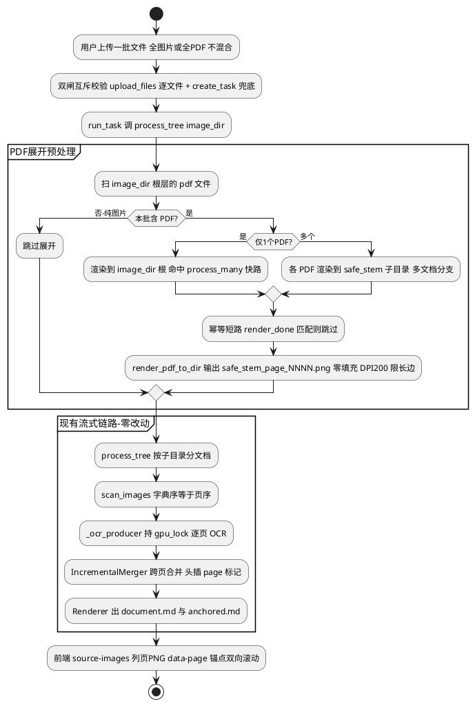

# PDF 输入支持设计（Epic A）

> 真相源：本文件。涉及接口/数据模型变更需同步 `docs/zh/backend/data-models.md`，
> 架构级变更同步 `docs/zh/architecture.md`，落地进度记 `docs/zh/progress.md`。
> 关联 issue：Epic A `#72`（A1 后端 `#75` / A2 前端 `#76`）。

## 1. 背景与目标

DocRestore 当前只接受文档屏摄照片（jpg/png/...）。Epic A 让用户能上传 **PDF**，
系统逐页渲染成图像后，走**完全相同**的 OCR → 跨页去重合并 → LLM 精修链路，输出原格式 markdown。

**范围约束（已与用户拍板）：**

- 一批输入**要么全是图片，要么全是 PDF**，不做混合批。
- **一个 PDF = 一篇文档 = 一个 `PipelineResult`**；不做 PDF 内章节自动拆分。
- 维持 **PaddleOCR-VL** 为唯一 OCR 引擎，**不引入 MinerU**（见
  [benchmark 结论](../../output/bench/quality/report.md)：MinerU 公式增量狭窄、屏摄场景更差、~20× 慢）。
- PDF 是**输入源维度**，正交于文档/代码/PPT 三种**精修模式**——渲染出页图后仍可走任一模式，
  **不引入第四个互斥模式**。

**设计原则**：最大化复用既有三大机制，核心流式链路一行不动：

| 复用机制 | 承载的 PDF 能力 | 位置 |
|---|---|---|
| `process_tree` 多子目录 = 多文档 | 多个 PDF → 多个 `PipelineResult` | pipeline.py:674-768 |
| `IncrementalMerger` 跨页去重合并 | PDF 跨页拼接（DocRestore 主能力 ④） | processing/dedup.py |
| `source-images` rglob + `data-page` 锚点 | 前端按页预览 + 滚动联动（A2） | routes.py:1331-1393 / 前端 |

## 2. 渲染引擎选型

| 候选 | 取舍 | 结论 |
|---|---|---|
| **pypdfium2** | PDFium（Chromium）绑定，Apache/BSD 许可、无 GPL 传染，纯 wheel 依赖面小；bench `scripts/bench_quality/render_inputs.py` 已用它跑通同一像素契约 | **选用**，新增运行时依赖 |
| PyMuPDF (fitz) | **AGPL** 许可对商用不友好；虽在 `vendor/DeepSeek-OCR-2` requirements 但属第三方 env，非主项目 | 否决 |
| pdf2image + poppler | 需系统级 poppler 二进制，部署复杂 | 否决 |
| MinerU `read_fn` | 已决策不引入 MinerU | 否决 |

渲染参数：**DPI 200**（`render_inputs.py` 已验证与 PaddleOCR-VL 同像素契约），
`page.render(scale=dpi/72.0).to_pil()`，输出 RGB PNG。

## 3. 总体数据流



**渲染落点目录布局**（一个 PDF 一篇文档）：

```
{image_dir}/                         # 上传会话目录（被 referenced_dirs 保护跳过 TTL 清理）
├── report.pdf                       # 原始 PDF 保留（非图片扩展名，scan_images/source-images 自动忽略）
└── report_page_0001.png ...         # 【单 PDF】渲染到根 → 命中 process_many 快路
                                     #   多 PDF 时改为下列子目录布局：
{image_dir}/
├── a.pdf / b.pdf
├── a/  └── a_page_0001.png ...      # 【多 PDF】每个 PDF 一个 safe_stem 子目录
└── b/  └── b_page_0001.png ...      #   process_tree 多子目录分支 → 每个一个 PipelineResult
```

## 4. 关键设计决策

### D1 — 渲染时机：pipeline 摄取入口，不进上传热路径

在 `process_tree` 最早处（`find_image_dirs` 之前）做一次「PDF → 页 PNG 展开」，
上传层（upload.py）只存盘 `.pdf` 不渲染。

- **为何不在上传时渲染**：上传层现为纯文件存储 + TTL，无任何图像依赖；上传时渲染会
  (a) 阻塞上传请求并把 pypdfium2 引入上传热路径；(b) 渲染产物只在 `upload_dir`，而
  `upload_dir` 会被 TTL 清理（1h，upload.py:58），resume 时（`POST /tasks/{id}/resume`
  复用 `output_dir` 命中 OCR 缓存）已无图可重渲。
- **为何摄取入口最优**：渲染产物落 `task.image_dir`（stage 目录，被
  `collect_referenced_image_dirs` 保护跳过 TTL 清理），resume/retry 复用同 `image_dir`；
  渲染是纯 CPU/IO，**不持 `gpu_lock`**（`gpu_lock` 仅在 `_ocr_producer` 的
  `engine.ocr()` 前获取 pipeline.py:1811-1815，发生在渲染之后）。
- 渲染是阻塞 IO，在 async 上下文用 `asyncio.to_thread` 包裹（python-coding-rules）。

### D2 — 渲染幂等（关键，支撑 resume/retry）

`resume`/`retry` 会重新进入 `process_tree` → 触发重新渲染。**必须做幂等短路**，
否则 (a) 白白重渲染整本 PDF，与「resume 省时间」初衷矛盾；(b) 若两次渲染产物的文件名/页数
不一致（pypdfium2 版本升级、坏页判定漂移），`{stem}_OCR/result.mmd` 缓存键错位，
resume 退化为全量重 OCR 或产生孤儿缓存。

**机制**：每个 PDF 渲染目标处落一个 sentinel `{目标目录}/.render_done.json`，记录
`{pdf_sha256, page_count, dpi, pdfium_version, naming}`。渲染前若 sentinel 存在且
`pdf_sha256` 与当前一致 → **整本跳过**（O(1)）。retry/resume 复用同 `image_dir` 时
直接命中，渲染产物与 OCR 缓存键稳定对齐。

### D3 — 单 PDF 渲染到根、多 PDF 分子目录

`process_tree` 快路判据为 `len(leaf_dirs)==1 and leaf_dirs[0]==image_dir`
（pipeline.py:722-724，已核实）。

- **单 PDF**：渲染到 `image_dir` 根（`doc_dir=""`）→ 命中 `process_many` 快路，
  避免凭空套上多子目录 warmup + 冷启动校准（`#44` 的「免白等」优化对单 PDF 仍生效）。
- **多 PDF**：每个渲染到 `{safe_stem}/` 子目录 → `process_tree` 多子目录分支天然落地
  「一个 PDF = 一个 `PipelineResult`」（`doc_dir=safe_stem`，pipeline.py:871-873）。
- 两种布局统一用 `{safe_stem}_page_NNNN.png` 命名前缀（见 D4），故单 PDF 平铺到根也零碰撞。

### D4 — 页命名 + basename 全局唯一（强制，非可选）

`{safe_stem}_page_{N:04d}.png`，N 从 1 起，固定零填充 4 位。

- **零填充必需**：`scan_images` 用 `sorted()` 字典序（pipeline.py:419-422），唯有固定宽度
  零填充才有「字典序 = 页序」；4 位覆盖 9999 页，远超 `max_pages` 默认 500
  （若部署将 `max_pages` 调过 9999，宽度按 `max(4, len(str(页数)))` 自动加宽——单行守卫）。
- **`{safe_stem}_` 前缀必需**：前端 `imageNameToPageKey` 只取 basename
  （sourceImagePreview.ts:10-12），page marker 也用 `image_path.name`（dedup.py:313/356）。
  多 PDF 时两本各自的 `page_0001.png` 会 **basename 撞车 → 前端串页**。加 `safe_stem` 前缀
  使 basename 全局唯一，复用现有锚点逻辑、**前端零改**。

### D5 — `pdf_stem` 安全净化

`pdf_stem` 来自用户文件名，**不可假设干净**（服务器源 / 直传 `image_dir` 的 PDF
不经上传层 `_secure_filename`）。净化规则：

- 剔除 / 折叠 `/ \\ ) ( 空格` 等字符（`)` 会破坏 renderer 图片重写正则
  `([^/)]+)_OCR/images/` renderer.py:141）；对齐 `_secure_filename` 语义。
- 净化后撞名的多 PDF（`a b.pdf` 与 `a_b.pdf` 都 → `a_b`）加去重后缀 `_2`/`_3` 或短 hash。
- 在渲染模块显式实现 `pdf_stem → safe_stem` 映射，子目录名与文件前缀同源。

### D6 — 全图片 / 全 PDF 互斥：双闸

- **闸一（上传层，最早）**：`upload_files` 逐文件校验时，首个通过的文件确定会话类型
  （image|pdf），后续异类直接进 `failed`（upload.py:250-285）。
- **闸二（建任务，兜底）**：`create_task`（routes.py:699）**新增** `image_dir` 内容扫描
  （当前 `create_task` 只透传 `image_dir` 字符串、不读内容，这是从零新增）。算法：
  仅扫 `image_dir` **根层** `iterdir`（与 `scan_images` 同层语义），统计 `.pdf` 数 vs
  图片扩展名数；二者皆 > 0 → 400 `MODE_CONFLICT`（仿 code/ppt 互斥 routes.py:747-754）。
  「根层有 `.pdf` + 子目录有图片」也判混合并拒绝（渲染后会半图半 PDF）。扫描包 `to_thread`。
  闸二覆盖绕过上传层的服务器源（`_stage_files`）/ 直传 `image_dir` 请求。

### D7 — 配置归属：独立 `PdfRenderConfig`，仅服务端默认

仿 `PowerPointRestoreConfig` 范式（config.py:407-423），新增 `PdfRenderConfig(BaseModel)`
挂 `PipelineConfig.pdf`。**不并进** `OCRConfig`（已含数十字段、语义错位：渲染是输入前置非
OCR 引擎参数）也不并进 `OutputConfig`（输出语义）。

```python
class PdfRenderConfig(BaseModel):
    enable: bool = True          # PDF 输入是否渲染（关闭则 .pdf 被忽略）
    dpi: int = 200               # 渲染分辨率
    max_pages: int = 500         # 单 PDF 页数硬上限（防内存/磁盘打爆）
    max_long_side: int = 4096    # 渲染 PNG 长边上限，超出按比例降采样
    zero_pad: int = 4            # 页号零填充位数
```

**本阶段仅用服务端默认**：不暴露给 `schemas`/请求级覆盖、不进 DB（零 migration、零
`_OCR_SAFE_OVERRIDE_ALLOW` 白名单维护）。等真有请求级覆盖需求再升级三层契约面。

### D8 — content_crop 对 PDF 页默认关闭

文档模式默认 `content_crop.enable=True`（config.py:433），它为**屏摄文档侧栏**
（左导航/右大纲/顶部 UI）设计；电子 PDF 页**无侧栏 UI**，自动裁剪无收益、只有投影/居中列
检测误裁正文的风险。虽 docstring 自称「无侧栏图自动恒等放行」，但 PDF 模式下默认关闭是
**零风险**选择。

**做法**：PDF 展开时，对该任务的 `content_crop` 覆盖为 `enable=False`（任务级覆盖，
不改全局默认）。**待用户确认**（见 §9）。

### D9 — 渲染 PNG 长边上限（防超大幅面页）

A0 海报 / 横向拼版 / CAD 图框在 DPI 200 下可达 7000–14000 px，超 PaddleOCR-VL 图像阈值
→ OOM 或引擎内部降采样致 grounding 坐标错乱。屏摄路径早有 `PHOTO_MAX_SIDE=2200` 先例，
PDF 路径对齐：`max_long_side`（默认 4096）超出按比例降采样。

> **Epic E 坐标系约定**：bbox 高亮坐标系 = **最终落盘 PNG 像素**（降采样后），
> 非「DPI 200 原始像素」。避免后续锚点契约自相矛盾。

## 5. 渲染模块接口

新建 `backend/docrestore/pipeline/render/pdf.py`（运行时模块，区别于脚本
`scripts/bench_quality/render_inputs.py`）。

```python
def render_pdf_to_dir(
    pdf_path: Path,
    out_dir: Path,
    *,
    cfg: PdfRenderConfig,
    name_prefix: str,          # = f"{safe_stem}_"，保 basename 全局唯一
) -> int:                      # 返回成功渲染页数
    """把单个 PDF 逐页渲染成零填充命名的 RGB PNG，落 out_dir。幂等 + 坏页鲁棒。"""
```

**实现要点**：

1. **幂等短路**：读 `out_dir/.render_done.json`，`pdf_sha256` 匹配 → 直接 return 记录页数。
2. `doc = pdfium.PdfDocument(str(pdf_path))`；`try/finally: doc.close()`。
3. `n = len(doc)`；`width = max(cfg.zero_pad, len(str(min(n, cfg.max_pages))))`。
4. `for i in range(min(n, cfg.max_pages))`：`page.render(scale=cfg.dpi/72.0).to_pil()`
   → `convert("RGB")` → 超 `max_long_side` 按比例降采样 → 存
   `out_dir/f"{name_prefix}page_{i+1:0{width}d}.png"`。
5. 写 `.render_done.json` sentinel。

| 失败类型 | 处理 |
|---|---|
| 单页 `page.render()` 异常 | `try/except` 跳过该页 + `logger.warning`，不中断整本；返回值 = 成功页数 |
| 加密无密码 / 文件损坏（`PdfDocument` 构造抛异常） | 上浮 → `process_tree` 转 `PipelineResult(error=...)`，该 PDF 失败、同任务其他 PDF 继续 |
| 全部页渲染失败（返回 0） | 调用方标记该 PDF `error`，不产空文档 |
| 页数超 `max_pages` | 截断渲染前 N 页 + `warning`（防内存/磁盘打爆） |

> **验证点**：单 PDF（单 leaf）失败时，需确认 `task_manager.run_task` 的 `failed_docs`
> 聚合能正确产出 `FAILED` 而非崩溃（`process_tree` 多目录 `return_exceptions` 占位逻辑
> 此前仅在 leaf > 1 验证过）。

## 6. 命名与锚点契约（三者对应链）

| 环节 | 取值 | 位置 |
|---|---|---|
| 页 PNG 文件名 | `{safe_stem}_page_{N:04d}.png`（N 从 1，零填充） | 渲染模块 |
| page marker | `<!-- page: {safe_stem}_page_0001.png -->`（用 `image_path.name`） | dedup.py:313/356 |
| source-images 列表 | rglob 相对路径（单 PDF `xxx_page_0001.png` / 多 PDF `b/b_page_0001.png`） | routes.py:1331-1340 |
| 前端 `data-page` 锚点 | `imageNameToPageKey` 取 basename = `{safe_stem}_page_0001.png` | sourceImagePreview.ts:10-12 |
| Epic E「第 N 页」稳定锚点 | `{safe_stem}_page_{N:04d}` 不可变 stem（渲染一次定死，贯穿 `{stem}_OCR` 目录与 marker） | — |

`{safe_stem}_` 前缀使 basename 全局唯一（D4），故无论单 PDF 平铺根目录还是多 PDF 分子目录，
前端 basename 锚点都不撞车，**前端无需感知目录层级**。

## 7. 改动面清单

### A1 — 后端（`#75`）

| 文件 | 改动 |
|---|---|
| `pipeline/render/pdf.py` | **新建** `render_pdf_to_dir()` + sentinel + 安全净化 |
| `pipeline/config.py` | **新建** `PdfRenderConfig` + `PipelineConfig.pdf` 字段（仿 ppt 范式 :407-448） |
| `pipeline/pipeline.py:700` | `process_tree` 入口（`find_image_dirs` 前）插「PDF 展开」：扫根层 `*.pdf` → 单/多 PDF 分流落点 → 逐个 `to_thread(render_pdf_to_dir)`；展开时对 `content_crop` 任务级覆盖关闭（D8） |
| `api/upload.py:52-54` | `_ALLOWED_EXTENSIONS` 加 `.pdf`（`allowed_extensions` 自动透出前端） |
| `api/upload.py:57,206-285` | PDF 单文件上限独立（图片 50 / PDF 200MB），`_save_uploaded_file` 上限参数化按 ext 分流；`upload_files` 逐文件全图/全 PDF 互斥（闸一），`failed` 项带原因码 |
| `api/routes.py:699` | `create_task` **新增** `image_dir` 根层扫描互斥兜底（闸二，`to_thread`） |
| `pyproject.toml:10-21` | dependencies 加 `pypdfium2>=4.0` |
| `api/routes.py:1262/1331-1393` | 确认 `_IMAGE_EXTS` 已含 `.png`（渲染产物自动被 source-images 列出/服务，源 `.pdf` 天然不列出）——**无需改** |
| `api/routes.py:193-249`（zip） | **不改**：只打 `document.md`+`images/`，不打源 PDF |
| `task_manager.py` / DB | **不动**：`PdfRenderConfig` 仅服务端默认，零持久化 |

### A2 — 前端（`#76`）

| 文件 | 改动 |
|---|---|
| `components/FileUploader.tsx:12` | `ACCEPT` 加 `application/pdf` |
| `components/FileUploader.tsx:15-38` | `ALLOWED_EXTENSIONS`/`filterImageFiles` 白名单加 `.pdf`；加客户端「全图/全 PDF」预校验提示 |
| `components/UploadPreviewPanel.tsx:13-42` | `.pdf` 上传中预览用 PDF 图标占位（PDF 不能 ``）+ 文案「页图将在任务开始后生成」 |
| `components/SourceImageList.tsx` / `sourceImagePreview.ts` | **无需改**：任务跑起后源图是页 PNG，`data-page` 锚点照常工作 |
| `api/schemas.ts:87-91`（`SourceImagesResponse`） | **不改**：`images: string[]` 已够，前端从 `{stem}_page_NNNN.png` 自解析页号 |
| `TaskForm.tsx` + i18n | 上传区文案加「一批要么全图片要么全 PDF」三语提示；模式选择保持不变（PDF 正交于精修模式） |

## 8. 测试与验收（mock 自测留证据）

> 禁写死数据集标识符；断言从输入派生（CLAUDE.md 测试规则）。

| 用例 | 断言 |
|---|---|
| **造 fixture** | 用 **Pillow** `Image.save(path, save_all=True, append_images=[...])` 构造 3 页 PDF（每页画可识别文字，从输入派生），存 `tests/fixtures/`（**不可用 reportlab——非依赖；不可用 pypdfium2——只渲不造**） |
| `render_pdf_to_dir` 正常 | 渲出恰好 3 个 `xxx_page_0001..0003.png`，`sorted()` = 页序，每张 PIL 可开且尺寸 > 0，返回 3 |
| 幂等 | 二次调用命中 `.render_done.json`，**不重渲染**（计时/产物 mtime 不变），返回页数一致 |
| 坏页 / 加密 | 含 1 坏页 → 跳过记 warning、其余正常、返回 = 成功页数；加密无密码 → `PdfDocument` 抛异常上浮成 `error`、进程不崩 |
| 长边上限 | 构造超 `max_long_side` 的大页 → 断言落盘 PNG 长边 ≤ 上限 |
| 集成（`FixtureOCREngine` 离线） | `process_tree`(含 3 页 PDF 的 image_dir) → 单 `PipelineResult`（单 PDF doc_dir 空 / 多 PDF = stem）、markdown 含派生页内容、`.anchored.md` 含 3 条 `<!-- page: ...page_0001.png ... -->` |
| 单 PDF 走快路 | 断言单 PDF 任务墙钟无 60s 量级 stall（命中 `process_many` 快路，未被多子目录冷启动拖累） |
| 互斥双闸 | 上传 1 图 1 PDF → `upload_files` 异类进 `failed`；混合 `image_dir` 调 `create_task` → 400 `MODE_CONFLICT` |
| 路由 | `GET /source-images` 列 3 个 `{stem}_page_NNNN.png`；`GET .../{stem}_page_0001.png` → 200 `image/png`；`GET` 源 `.pdf` 路径 → 404 |

**留证**：保存「3 页 PDF fixture + 每页文字 → 渲染产物列表+尺寸 → 合并 markdown + marker 列表
→ source-images 响应」输入输出对照到测试输出，作为 A1/A2 验收证据。

## 9. 已确认决策（2026-06-17 用户拍板）

| # | 决策 | 结论 |
|---|---|---|
| Q1 | content_crop 对 PDF 页 | ✅ **默认关闭**（PDF 模式任务级覆盖 `content_crop.enable=False`，D8） |
| Q2 | PDF 单文件上限 | ✅ **200MB**（图片仍 50MB；`_save_uploaded_file` 上限按 ext 分流） |
| Q3 | `max_pages` 硬上限 + 超限行为 | ✅ **500，超限截断前 500 页 + warning**（非整本拒绝） |
| Q4 | `PdfRenderConfig` 请求级覆盖 | ✅ **否，先固定服务端默认**（零 DB/白名单改动） |
| Q5 | 下载 zip 含源 PDF | ✅ **否，只 markdown+images** |

## 10. 工程量判断：刚刚好（偏精简）

- **复用三大机制零另起炉灶**：`process_tree` 多文档 / `IncrementalMerger` 跨页 /
  source-images 锚点全复用，核心流式 OCR→去重→精修链路**一行不动**。真正新增仅
  `render/pdf.py` + `PdfRenderConfig` + 上传/校验扩展名放行。
- **刻意不做**（避免过度工程）：PDF 章节自动拆多文档（约束已定 1 PDF=1 文档）、四选一模式
  互斥（PDF 正交于精修模式）、DB migration（配置仅服务端默认）、上传时渲染。
- **必补防欠工程**（吸收对抗式评审）：D2 渲染幂等、D4 basename 前缀强制、D5 stem 净化、
  D6 互斥双闸算法、D8 content_crop 关闭、D9 长边上限——这六处若漏，会在 resume 重渲染 /
  前端多 PDF 串页 / 规整 PDF 误裁 / 大页 OOM 处连环炸。
