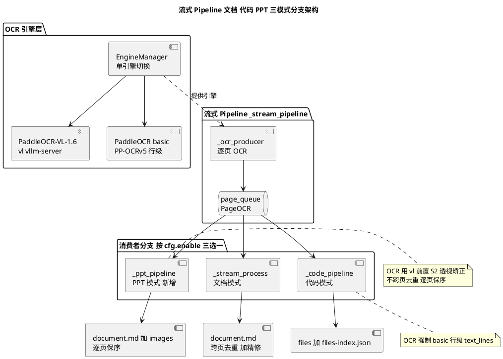
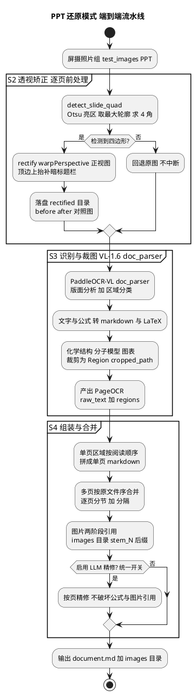

# PPT 还原模式设计文档（S1 / AGE-85）

> **状态**：S1 设计已确认（2026-06-03，§14 六项拍板）→ 生成 OpenSpec 中
> **对应 issue**：父 AGE-83；本文 = AGE-85（S1[design]）；下游 AGE-86(S2) / AGE-87(S3) / AGE-88(S4) / AGE-89(S5) / AGE-90(S6)
> **上游**：AGE-84（S0 spike）选型结论已落地（VL-1.5→1.6 全面升级合并 `dev`，commit `15faf0f`）
> **真相源约定**：本文经用户确认后生成 OpenSpec，作为下游 S2–S6 编码唯一真相源；编码时若与实际代码冲突，以代码 + OpenSpec 为准，回头修订本文。

---

## 1. 背景与目标

把一组 **PPT 屏摄照片**（会议幻灯片投影在 LED 屏上的实拍，`test_images/PPT/*.jpg`）还原为**单个 markdown 文档**：

- 完整文字（中英混排）
- 数学公式 → LaTeX（失败回退图片或原样文本）
- 图片类区域（化学骨架式、分子模型/球棍图、反应路径图、数据表/图表、神经网络示意图）→ **裁剪保留为图片**，markdown 用 `` 引用
- **页序与原 PPT 一致**

**真图硬特征**（决定架构）：画面里是一个**透视倾斜的四边形**（上有吊顶、下有观众头部，部分照片观众头部遮挡屏幕下边缘），存在屏摄摩尔纹/反光风险 → **区域检测 + 透视矫正是关键前处理**。

---

## 2. S0 选型结论摘要（已确认，不再讨论）

| 维度 | 结论 | 依据 |
|---|---|---|
| 主引擎 | **PaddleOCR-VL-1.6**（`doc_parser`，vllm-server 后端） | 原始屏摄只命中 ~30%；矫正后 ~95%+；最快（15–22s vllm）；已是项目引擎，集成成本最低 |
| 透视矫正(S2) | **必需**，独立前处理 | 屏摄强透视是硬场景；矫正是所有引擎共用前处理 |
| 化学结构 | VL doc_parser **自动裁成图片**，不转文字 | 契合"图片含化学式/分子模型"需求，无需 MolScribe |
| MinerU / dots.ocr | **本阶段剔除** | 用户 2026-06-01 拍板：DocRestore 主导自研管线，不作 MinerU 插件 |
| OCR pipeline | PPT 用 `vl`（同文档模式）；**非** `basic`（代码模式才用 basic） | VL doc_parser 才有版面分析 + 区域裁图能力 |

**矫正算法（S2，OpenCV）**：Otsu 取亮区 → 最大轮廓 → `approxPolyDP` 取 4 角 → `warpPerspective` 转正视图；顶边上抬 ~20% 补暗标题栏；失败回退原图不中断。

---

## 3. 架构定位

PPT 模式是流式 Pipeline 的**第三消费者分支**（与文档模式 `_stream_process`、代码模式 `_code_pipeline` 平行），三者**互斥三选一**，共享同一 `_ocr_producer` + `page_queue`。

**与另两模式的核心异同：**

| 维度 | 文档模式 | 代码模式 | **PPT 模式（新增）** |
|---|---|---|---|
| 消费者 | `_stream_process` | `_code_pipeline` | **`_ppt_pipeline`** |
| OCR pipeline | `vl` | 强制 `basic`（行级） | **`vl`** |
| 前处理 | 无 | 无 | **S2 透视矫正（逐页）** |
| 跨页关系 | **跨页去重 + 流式精修** | 跨页归类成源文件 | **不去重，逐页独立保序** |
| LLM | 分段精修（重） | 字符级修正/重写 | **按页精修** |
| LLM 精修开关 | 统一 `LLMConfig.enable_refine`（默认开） | 同左 | 同左（AGE-9x，§15） |
| 图片 | 两阶段引用 | 无 | **两阶段引用（复用文档模式）** |
| 输出 | `document.md` + `images/` | `files/` + `files-index.json` | **`document.md` + `images/`** |



---

## 4. 端到端流水线（S2 → S3 → S4）



**阶段职责：**

- **S2（AGE-86）**：原屏摄照片 → 检测幻灯片四边形 → 矫正为正视图，落盘 before/after 对照，失败回退原图。产物喂给 `_ocr_producer`。
- **S3（AGE-87）**：矫正图 → VL-1.6 `doc_parser` 版面分析 + 区域分类 + 识别。文字/公式入 `raw_text`（markdown + LaTeX），图形区域裁成 `Region.cropped_path`。产出 `PageOCR`。
- **S4（AGE-88）**：单页区域按阅读顺序拼成单页 markdown → 多页按原文件序合并为单 `document.md`（逐页分节）→ 图片两阶段引用落 `images/`。
- **按页精修（AGE-9x）**：`_ppt_pipeline` 出队循环内逐页 LLM 精修（与 producer OCR 重叠），由统一开关 `LLMConfig.enable_refine` 控制；详见 §15。

---

## 5. 数据结构

### 5.1 `PowerPointRestoreConfig`（后端，挂 `PipelineConfig.ppt`）

与 `CodeRestoreConfig`（`config.py:308`）平行的新 BaseModel：

```python
class PowerPointRestoreConfig(BaseModel):
    """PPT 还原模式配置。enable=True 时启用第三分支 _ppt_pipeline。"""
    enable: bool = False                      # 模式总开关
    rectify: bool = True                      # S2 透视矫正（默认开，S0 结论：必需）
    rectify_save_debug: bool = True           # 落盘 before/after 对照图（用户确认）
    rectify_debug_dir: str = ".rectified"     # 对照图子目录（相对 output_dir）
    rectify_top_extend_ratio: float = 0.2     # 顶边上抬补暗标题栏比例
    crop_figures: bool = True                 # 图形区域裁成 images/（化学结构等）
    images_dir: str = "images"                # 图片输出子目录（复用文档模式）
```

> **LLM 精修不在本 config**（AGE-9x 变更，见 §15）：原 `llm_polish` 字段实测无效已删除。
> 是否精修由**统一开关 `LLMConfig.enable_refine`**（默认 `True`）控制，文档（分段）/
> 代码 / PPT（按页）三模式共用；PPT 模式在 `_ppt_pipeline` 出队循环内**按页**调用
> 既有段级精修器（`_refine_segment_with_cache`），与 producer OCR 重叠。

> 字段命名沿用 `CodeRestoreConfig` 风格（`enable` + 行为开关 + 子目录名）。VL 引擎参数（`paddle_pipeline=vl` / `paddle_pipeline_version` / `paddle_server_model_name` / `backend_config`）复用 `OCRConfig`（`config.py:142`），**不在本 config 重复**。

### 5.2 单页中间结构

VL `doc_parser` 输出天然落入现有 `PageOCR`（`models.py:50`），**无需新建数据类**：

| 现有字段 | PPT 模式用途 |
|---|---|
| `raw_text: str` | VL 产出的单页 markdown（含 LaTeX 公式 + `` 图片引用） |
| `regions: list[Region]` | 图形区域；`Region.cropped_path`（`models.py:32`）= VL 自动裁图落点 |
| `image_path / image_size` | 原始（或矫正后）照片路径与尺寸 |
| `output_dir` | `{output_dir}/{stem}_OCR/` |

阅读顺序：VL `doc_parser` 输出的 markdown 已是阅读顺序排好的，S4 直接消费 `raw_text` 行序即可；**不需要在 PPT 模式额外引入 region bbox 排序**（与 issue 占位描述中"区域列表 + 阅读顺序"相比是简化——VL 已内建版面阅读序）。

> ⚠️ 待确认点（见 §11-D）：若实测 VL 单页 markdown 阅读序在多栏/化学版式下错乱，再回退到"region bbox 显式排序"方案。

### 5.3 `PipelineResult` 复用

PPT 模式复用文档模式的 `PipelineResult`（`markdown` 字段 = 合并后 `document.md` 内容，`images` = 裁图列表，`error` 占位失败）。**不新增结果类型**，前端多文档展示链路（AGE-33 已有）零改动即可渲染。

---

## 6. 模块函数签名草案（供 S2 / S3 / S4 对齐）

> 签名为 S1 契约草案；S2/S3/S4 各自动手前以本节为"头文件"对齐，编码后回填实际签名。

### S2 透视矫正（新增 `processing/slide_rectify.py`）

```python
@dataclass(frozen=True)
class Quad:
    """幻灯片四角点，顺序：左上 右上 右下 左下（像素坐标）。"""
    points: tuple[tuple[int, int], tuple[int, int], tuple[int, int], tuple[int, int]]

def detect_slide_quad(image_bgr: np.ndarray) -> Quad | None:
    """Otsu 亮区 → 最大轮廓 → approxPolyDP 取 4 角。检测失败返回 None。"""

def rectify(image_bgr: np.ndarray, quad: Quad, *, top_extend_ratio: float = 0.2) -> np.ndarray:
    """warpPerspective 转正视图，顶边按比例上抬补暗标题栏。"""

async def rectify_page(
    image_path: Path, output_dir: Path, cfg: PowerPointRestoreConfig,
) -> Path:
    """逐页矫正入口：读图 → detect → rectify → 落盘矫正图 + before/after 对照。
    失败（检测不到四边形 / 异常）回退原图路径，不抛异常。
    返回供下游 OCR 使用的图片路径。OpenCV 阻塞调用走 asyncio.to_thread。"""
```

### S3 识别（复用现有 OCR 引擎，无新签名）

VL `doc_parser` 本身就是已集成的 OCR 引擎，沿用现有接口（`ocr/base.py:72`）：

```python
async def ocr(self, image_path: Path, output_dir: Path) -> PageOCR: ...
```

区域裁图由 VL worker 自动产出到 `PageOCR.regions[].cropped_path`，**S3 无需新增识别代码**。PPT 模式由 `_ocr_config_for_ppt_mode` **强制 `paddle_pipeline="vl"`**（AGE-9x，与代码模式强制 basic 对称，防误配 basic 静默降级）。S3 的工作量主要落在**验证 VL 裁图覆盖化学结构/分子模型**（spike 已验证）+ 公式 LaTeX 兜底。

### S4 组装与合并（新增 `output/ppt_renderer.py`）

```python
async def render_ppt_document(
    pages: list[PageOCR],              # 按原文件序（scan_images 序）
    output_dir: Path,
    *,
    output_config: OutputConfig | None = None,
    bodies: list[str] | None = None,   # 按页预精修正文（与 pages 等长）；None=内部 rewrite
) -> tuple[Path, str]:
    """单页 raw_text（VL 阅读序 markdown）→ 逐页分节合并 document.md
    → 图片两阶段引用落 images/。返回 (document.md 路径, 含 page-marker 的内存版 markdown)。
    复用 renderer.py 的 _rewrite_and_copy_images 做图片重写。
    bodies 非空时按页直接拼装（精修结果），不再重复 rewrite。"""
```

### PPT 消费者分支（新增 `pipeline.py::_ppt_pipeline`）

```python
async def _ppt_pipeline(
    self,
    page_queue: asyncio.Queue[PageOCR | None],
    output_dir: Path,
    report_fn: ReportFn,
    *,
    llm: LLMConfig | None,
    total: int,                        # 预期页数（len(images)），仅用于进度/精修上下文
    quality: QualityReport | None = None,
) -> PipelineResult:
    """逐页出队 → rewrite_image_refs →（统一开关开时）按页 LLM 精修 →
    单页保序组装合并 document.md（不去重）。**按页精修在出队循环内完成**，
    精修第 i 页与 producer OCR 第 i+1 页重叠（同文档模式段级精修）；是否精修由
    _get_refiner(llm) 统一开关（LLMConfig.enable_refine）控制（见 §15）。"""
```

---

## 7. 模式分支接入点（文件:行）

> 行号为 S1 草案定位（基于现状代码检索），编码时以实际为准；标 **新增** 的是新文件。

| # | 文件:行 | 改动 |
|---|---|---|
| 1 | `pipeline/config.py:308`（`CodeRestoreConfig` 后） | 新增 `PowerPointRestoreConfig`（§5.1） |
| 2 | `pipeline/config.py:360`（`PipelineConfig`） | 加字段 `ppt: PowerPointRestoreConfig = Field(default_factory=...)` |
| 3 | `api/schemas.py:74`（`CodeRestoreConfigRequest` 后） | 新增 `PowerPointRestoreConfigRequest`（§8） |
| 4 | `api/schemas.py:87`（`CreateTaskRequest`） | 加字段 `ppt: PowerPointRestoreConfigRequest \| None = None` |
| 5 | `api/routes.py:387`（config 合成段） | 加 `ppt_cfg = defaults.ppt.model_copy(update=req.ppt.model_dump(exclude_none=True))`；**互斥校验**：`req.code.enable` 与 `req.ppt.enable` 不可同真 |
| 6 | `pipeline/task_manager.py:59`（`Task` dataclass） | 加 `ppt: PowerPointRestoreConfig \| None = None` |
| 7 | `pipeline/task_manager.py:269 / :161` | `insert_task(ppt=…)` 持久化 + hydrate 回填；**DB 加 `ppt` JSON 列 + migration** |
| 8 | `pipeline/pipeline.py:513 / :713` | `process_tree` / `process_many` 签名加 `ppt: PowerPointRestoreConfig \| None = None` |
| 9 | `pipeline/pipeline.py:755` | `_stream_pipeline` 签名加 `ppt` 参数 |
| 10 | `pipeline/pipeline.py:812` | 加 `ppt_cfg = ppt if ppt is not None else self._config.ppt` |
| 11 | `pipeline/pipeline.py:816` | `ocr_effective` 分支：PPT 模式用 `vl`（**不**走 `_ocr_config_for_code_mode`） |
| 12 | `pipeline/pipeline.py:831`（分支点） | 加 `elif ppt_cfg.enable: result = await self._ppt_pipeline(...)` |
| 13 | `pipeline/pipeline.py:1294`（`_ocr_producer`） | 加可选前处理 hook：PPT 模式逐页先 `rectify_page` 再 OCR |
| 14 | `processing/slide_rectify.py` **新增** | S2 矫正（§6） |
| 15 | `output/ppt_renderer.py` **新增** | S4 组装（§6） |
| 16 | `frontend/src/components/TaskForm.tsx:223 / :472 / :714` | 模式三选一互斥（§10） |
| 17 | `frontend/src/i18n/{en,zh-CN,zh-TW}.ts` | PPT 模式 i18n keys（§10） |

---

## 8. API 契约

```python
class PowerPointRestoreConfigRequest(BaseModel):
    """请求级 PPT 模式覆盖（全可选，None = 用后端默认）。"""
    enable: bool | None = None
    rectify: bool | None = None
    rectify_save_debug: bool | None = None
```

> 是否 LLM 精修不在 PPT 请求里：经 `LLMConfigRequest.enable_refine`（统一开关）控制（§15）。

- `CreateTaskRequest.ppt: PowerPointRestoreConfigRequest | None = None`
- **合成优先级**：`req.ppt`（非空字段）> `defaults.ppt`，沿用 `model_copy(update=exclude_none)`（与 `code` 同机制，`routes.py:387`）。
- **互斥校验**（`routes.py` 内）：`code.enable` 与 `ppt.enable` 同时为真 → 抛 `ApiBusinessError(code="mode.conflict", params={...})`（前端 `LocalizedError` 渲染，错误链路复用 `error_i18n_refactor`）。
- 内部细粒度字段（`rectify_top_extend_ratio` / `images_dir` / `rectify_debug_dir` 等）**不透出请求级覆盖**，避免请求面过宽；需要时再加。

---

## 9. 输出格式

- **`document.md`**：逐页分节，按 `scan_images` 文件序（= 原 PPT 序）。每页正文前插 `<!-- page: {filename} -->` marker（复用文档模式 page-anchor，前端滚动锚点）；页间用 markdown 分隔线分隔。
- **磁盘版 / 内存版**：磁盘 `document.md` 去 page marker（复用 `renderer.py:72` 正则）；内存版（`PipelineResult.markdown`）保留 marker 供前端滚动定位。
- **图片**：复用文档模式两阶段引用（`renderer.py:89 _rewrite_and_copy_images`）——VL 产出 `{stem}_OCR/images/N.ext` → 复制 + 重写为 `images/{stem}_N.ext`。
- **矫正对照（S2 证据）**：`{output_dir}/.rectified/{stem}_before.jpg` + `_after.jpg`（`rectify_save_debug=True` 时）。打包下载默认**不含** `.rectified/`（点目录，调试用），与代码模式 `.quality_report.json` 处理一致。

---

## 10. 前端 UI 契约（三选一互斥）

**现状**：代码模式是独立 `codeMode` toggle（`TaskForm.tsx:223`），与文档模式靠"勾选/不勾选"区分。新增 PPT 后需**三选一互斥**（AGE-89）。

**方案（推荐 radio 单选，见 §14-C 待确认）**：引入单一状态 `mode: "doc" | "code" | "ppt"`（默认 `"doc"`），用 radio 渲染，替代独立 `codeMode` toggle。

```typescript
const [mode, setMode] = useState<"doc" | "code" | "ppt">("doc");
const [refineEnabled, setRefineEnabled] = useState(true);  // 统一 LLM 精修开关（全模式）
// 提交时（TaskForm.tsx:472 附近）：
const code = mode === "code" ? { enable: true } : undefined;
const ppt  = mode === "ppt"  ? { enable: true } : undefined;
// refine 关闭时即使无其它覆盖也必须发 llm（携带 enable_refine=false）
const llm = (...其它覆盖... || !refineEnabled)
  ? { ...其它字段, enable_refine: refineEnabled } : undefined;
onSubmit(trimmed, outputDir, llm, pii, ocr, code, ppt);
```

- `onSubmit` 签名追加 `ppt?: PowerPointRestoreConfig`；`useTaskRunner` 透传到 `CreateTaskRequest.ppt`。
- 前端 `PowerPointRestoreConfig` 接口：`{ enable: boolean }`（**无** `llm_polish`，AGE-9x 删）。
- **统一 LLM 精修开关**（AGE-9x，见 §15）：独立于模式 radio 的单一 toggle，绑 `refineEnabled`（默认开），对文档 / 代码 / PPT 三模式均生效，写入 `llm.enable_refine`。**不再有 PPT 专属润色开关**。
- **i18n keys**（`en.ts` / `zh-CN.ts` / `zh-TW.ts` 同位置）：`taskForm.modeLabel` / `taskForm.mode_doc` / `taskForm.mode_code` / `taskForm.mode_ppt` / `taskForm.docModeDesc` / `taskForm.pptModeDesc` / `taskForm.refineTitle` / `taskForm.refineDesc` / `progress.pptPage`。
- 互斥天然由 radio 单选保证；后端再加一道校验（§8）防御非常规请求。

---

## 11. 关键设计决策与取舍

| 决策 | 选择 | 理由 / 取舍 |
|---|---|---|
| A. 跨页去重 | **不去重，逐页保序** | PPT 每张照片 = 一张独立幻灯片，无文档式跨页内容连续；去重逻辑（`PageDeduplicator`）是为长文档跨页重叠设计的，PPT 套用会误删重复版式。按 `scan_images` 文件序 1:1 映射页序。 |
| B. LLM 精修 | **可选轻润色，默认关 + 前端可开** | VL doc_parser 单页 markdown 质量已高；重度分段精修（文档模式那套）会破坏公式与图片引用且无收益。`llm_polish=False` 默认，但前端透出开关——用户视 OCR 效果决定是否开润色（用户确认 B）；开启时 prompt 约束不得改公式与图片引用。 |
| C. 单页中间结构 | **直接复用 `PageOCR`，不引入 region 排序** | VL 输出 markdown 已是阅读序；额外建 region 列表 + bbox 排序是过度工程。S3 实测若 VL 阅读序错乱（多栏/化学版式）再回退 region bbox 排序（用户确认 D，§14-D）。 |
| D. 矫正位置 | **`_ocr_producer` 内逐页前处理 hook** | 矫正是 CPU（OpenCV），OCR 是 GPU；放 producer 内最小侵入，复用现有 producer/consumer 骨架，无需新 stage。 |
| E. 矫正失败 | **回退原图不中断** | 屏摄四边形检测有失败概率；兜底回退保证流程不挂，VL 对轻微透视仍有 ~30% 基线。 |

---

## 12. 工程量评估：**刚刚好**

- **不过度**：复用 producer/consumer 骨架、`PageOCR`、`PipelineResult`、两阶段图片引用、前端多文档展示（AGE-33）；不引入 region bbox 中间层、不新建结果类型、不重复 VL 引擎参数。
- **不欠**：矫正落盘可见证据（S2 验收门）、模式互斥校验、矫正失败兜底、page-anchor 滚动定位齐全。
- **净新增**：2 个新文件（`slide_rectify.py` / `ppt_renderer.py`）+ 1 config + 1 request schema + 1 消费者分支 + 1 producer hook + 前端三选一 + DB migration。

---

## 13. 子 issue 拆解映射（S2–S6）

| Issue | 对应本文 | 主要产出 |
|---|---|---|
| AGE-86 (S2) | §6 S2 + §7#13–14 | `slide_rectify.py` + producer hook + before/after 对照证据 |
| AGE-87 (S3) | §6 S3 + §5.2 | VL `doc_parser` 包装验证（裁图覆盖化学结构 + 公式 LaTeX 兜底） |
| AGE-88 (S4) | §6 S4 + §9 | `ppt_renderer.py`：单页保序组装 + 多页合并 `document.md` |
| AGE-89 (S5) | §7#1–12, #16–17 + §8 + §10 | config/schema/routes/task_manager/pipeline 接入 + 前端三选一 + DB migration |
| AGE-90 (S6) | 全文 | E2E 真图验证 + 质量门禁 + 文档/进度/memory 收尾 |

---

## 14. 决策确认（已拍板 2026-06-03）

| # | 决策 | 结论 |
|---|---|---|
| A | 跨页去重 | ✅ **不去重**，照片序 = 页序（§11-A） |
| B | LLM 轻润色 | ✅ **默认关 + 前端透出开关**：用户视 OCR 效果决定是否开润色（§11-B / §10） |
| C | 前端模式选择 | ✅ **一条「模式」选项，radio 三选一并列**（文档 / 代码 / PPT），替代独立 codeMode toggle（§10） |
| D | 单页阅读序 | ✅ **信任 VL markdown**；S3 实测若错乱（多栏/化学版式）再回退 region bbox 排序（§11-C） |
| E | 页间分隔 | ✅ **markdown 分隔线 + page marker**（§9） |
| F | DB migration | ✅ **同 `code` 列机制**，老任务无需手动迁移（§7#7） |

> 6 项已确认（含 B / D 的实测留口）。据此生成 OpenSpec（change proposal + spec deltas），下游 S2–S6 据此细化内部步骤。

---

## 15. 变更记录

### AGE-9x：统一 LLM 精修开关 + PPT 按页精修（2026-06-03）

**背景**：S5 落地的 PPT 专属 `llm_polish` 开关**实测无效**——`_ppt_pipeline` 仅记 warning
占位、从未调用精修器。用户要求：**所有模式用同一个 LLM 精修开关统一控制是否精修，
PPT 模式不再单独设功能**。

**决策**（取代 §14-B「PPT 专属轻润色」）：

| 项 | 旧（S5） | 新（AGE-9x） |
|---|---|---|
| 开关位置 | `PowerPointRestoreConfig.llm_polish` | **统一 `LLMConfig.enable_refine`**（默认 `True`） |
| 作用范围 | 仅 PPT | **文档 / 代码 / PPT 三模式共用** |
| PPT 精修实现 | 占位 no-op（warning） | **按页精修**：`_ppt_pipeline` 出队循环内逐页调 `_refine_segment_with_cache`，与 producer OCR 重叠（同文档模式段级精修的并行思路，只是粒度=页） |
| 统一拦截点 | 无 | `_get_refiner(llm)`：`enable_refine=False` → 返回 `None`，各模式既有 `if refiner is None: 跳过` 回退路径统一生效 |
| 前端 | PPT 专属 `pptPolish` toggle | **独立于模式 radio 的单一「LLM 精修」toggle**（默认开），写 `llm.enable_refine` |

**落地点**：`LLMConfig.enable_refine`（`config.py`）/ `Pipeline._get_refiner` + `_ppt_pipeline`
按页精修 / `render_ppt_document(bodies=...)` 接收按页预精修正文 / `schemas.LLMConfigRequest.enable_refine`
/ `TaskForm` 单一 refine toggle + 三语 i18n（`taskForm.refineTitle/refineDesc` / `progress.pptPage`）。
顺带修复：`retry_task`/`resume_task` 转发 `ppt=task.ppt`、`get_task_async` 补 `code=row.code`
（原 review 发现的 PPT 重试丢配置 bug）。

### max-effort code-review 修复（2026-06-03，用户确认 4 项全修）

1. **`slide_rectify.rectify()` height 重复放大 ~20%**：`tl/tr` 原是 `src` 的 numpy view，原地外扩后
   `_dist` 把上抬量算进边长、再 `*(1+ratio)` 等于 `(1+ratio)²`。修法：角点取 `.copy()` 再外扩 src。
2. **PPT 强制 VL**：新增 `_ocr_config_for_ppt_mode` + `_ocr_config_for_mode` 分派器，PPT 分支强制
   `paddle_pipeline="vl"`（与代码模式强制 basic 对称）。依据：官方文档表明 PPT 还原所需
   markdown+LaTeX 公式+裁图+阅读序**只有 PaddleOCR-VL 能端到端产**（PP-OCRv5 纯文本 / PP-StructureV3
   无 markdown 无 VLM 语义 / PP-ChatOCRv4 是 KIE）；属能力匹配而非质量对比，故不跑 4 路 bake-off。
3. **`_rectify_sync` 落盘兜底**：mkdir + 两次 imwrite 整体包 `try/except (OSError, cv2.error)` → 回退原图，
   兑现"任何失败回退原图、不中断 OCR"契约（原先这段在 try 外，只读目录/编码失败会崩 task）。
4. **`_order_corners` 旋转塌缩**：旧 x+y/y-x 启发式对旋转四边形会把两角判到同一点（src 退化 → 奇异矩阵）。
   改"相对质心极角升序排环 + x+y 最小者为左上锚点"，保证 4 角互异。

各项均带回归测试，质量门禁全绿（pytest 1001 passed）。
